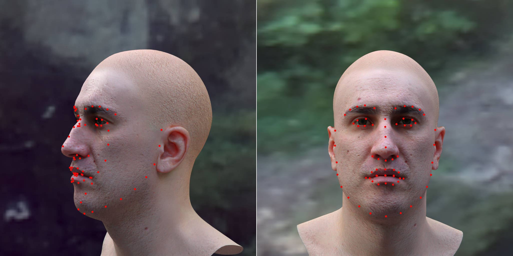
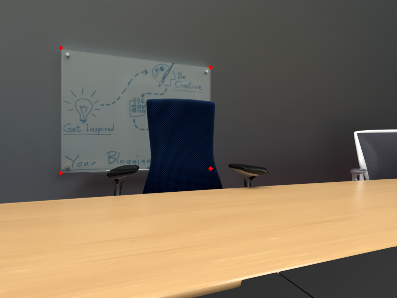

# Projecting Landmarks

## Project facial-landmarks to image-space

The `project_landmarks_on_images.py` script projects facial landmarks onto the RGB image for visualization.



### Usage
The arguments for the script are passed via the config file. All the parameters in the
 config file can be overriden from the command line. 
 
Example: Visualize landmarks for all images in dir `samples/` and save output to same dir.
 
 ```shell script
python project_landmarks_on_images.py dir.input=samples/ dir.output:null
```

## Project facial-landmarks to 3D pointcloud

The following will project the landmarks to 3D space and create a pointcloud.

```shell script
python project_landmarks_to_3d.py dir.input=samples
```

## Project whiteboard corners to image space

The following will project the landmarks representing the corners of a whiteboard
onto the image space:

```shell script
python project_whiteboard_landmarks_to_image.py dir.input=samples_whiteboard/
```



## Installation
The script requires python 3. Tested on Python 3.8.3. Install pip packages via:

```shell script
pip install -r requirements.txt
```
